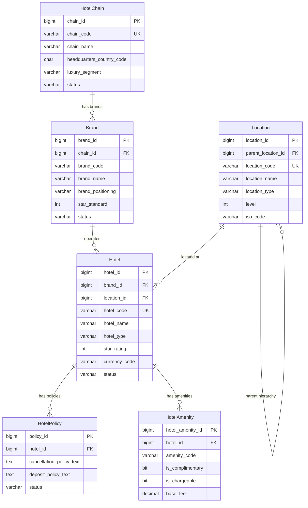
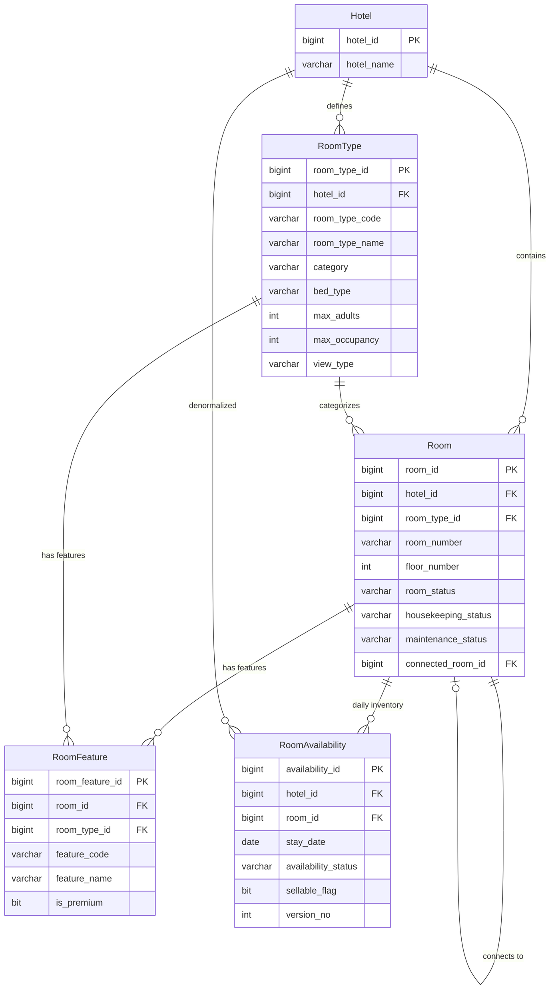
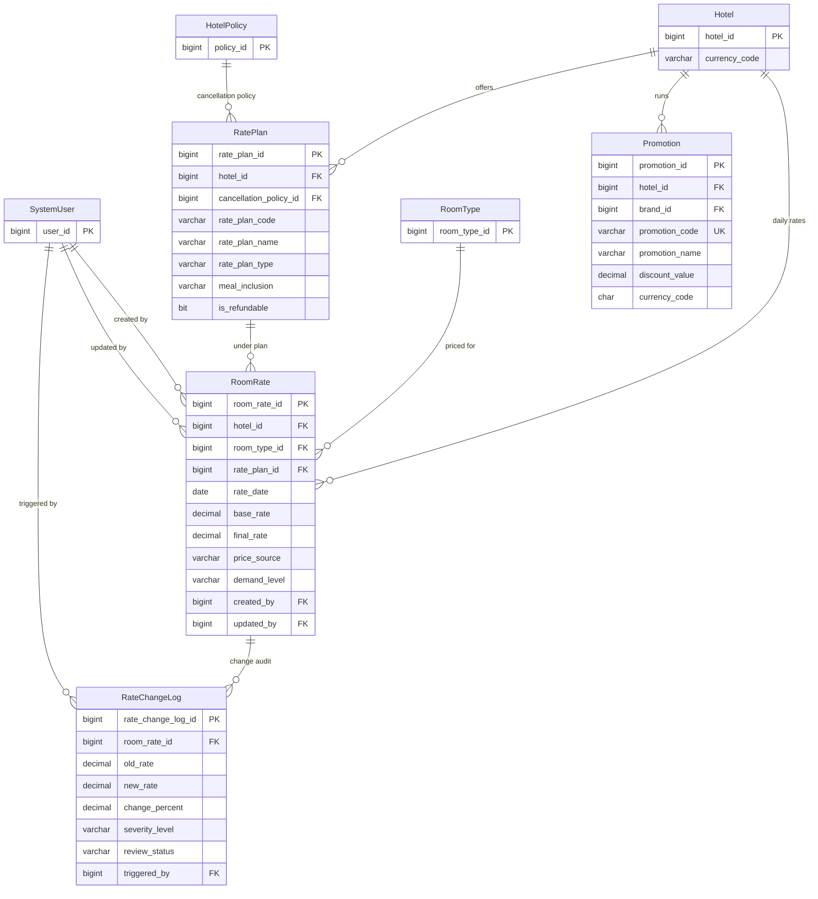
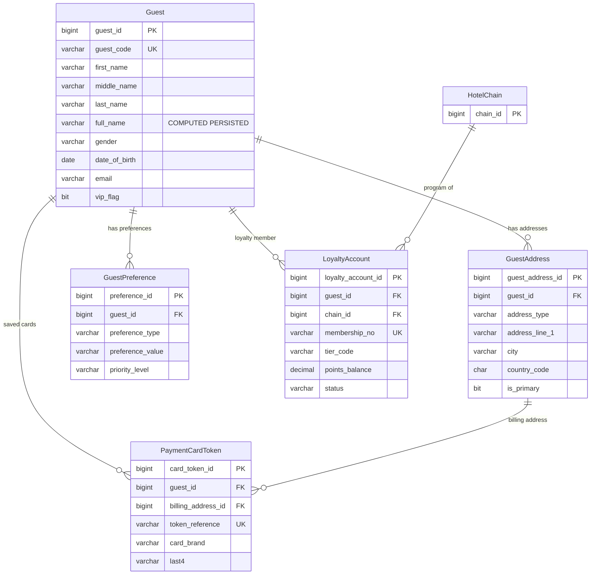
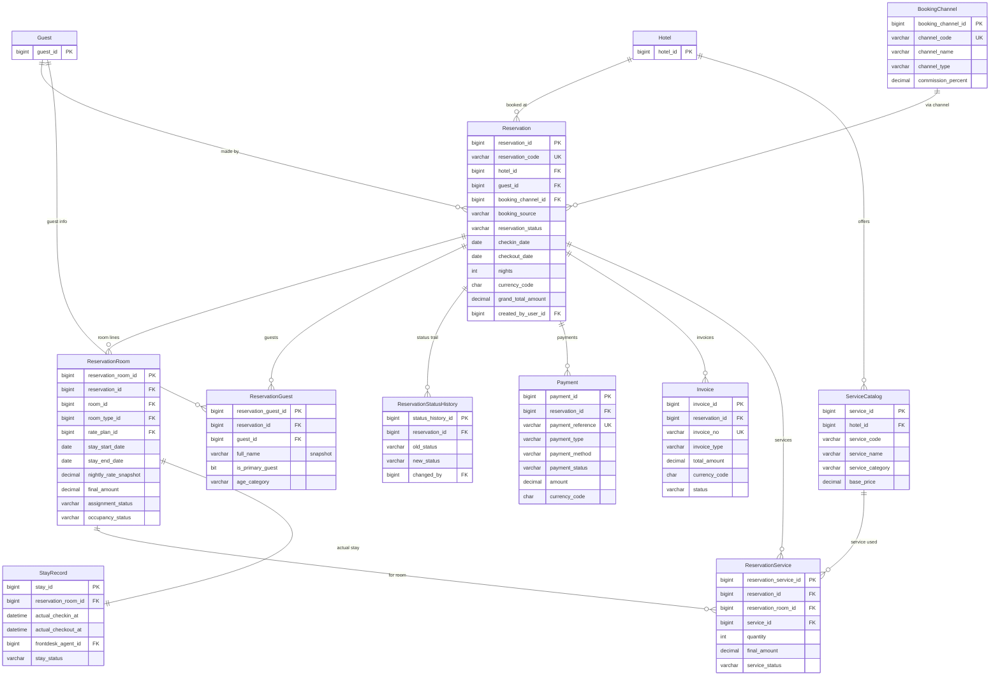
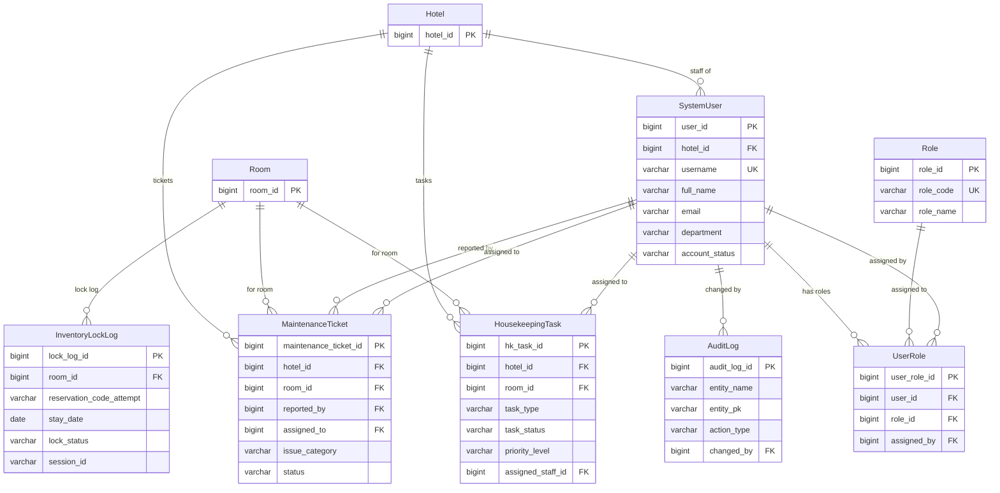

# LuxeReserve — Entity Relationship Diagram (Mermaid)

> **Source**: `GlobalLuxuryHotelReservationEngine_REMAKE.groovy`
> **30 bảng** | **SQL Server + MongoDB Hybrid**

---

## ERD Tổng quan (Full Schema)

> Vì schema có 30 bảng, ERD được chia thành **6 domain diagrams** để dễ đọc, sau đó có 1 diagram tổng hợp ở cuối.

---

### 1. Hotel Management Domain

---

### 2. Room Management Domain

---

### 3. Rate & Pricing Domain

---

### 4. Guest Management Domain

---

### 5. Reservation & Payment Domain

---

### 6. Operations & System Domain

---

## ERD Tổng hợp — Quan hệ giữa các Domain (High-Level)

```mermaid
erDiagram
    HotelChain ||--o{ Brand : "owns"
    Brand ||--o{ Hotel : "operates"
    Location ||--o{ Location : "self-ref hierarchy"
    Location ||--o{ Hotel : "located at"

    Hotel ||--o{ HotelPolicy : "policies"
    Hotel ||--o{ HotelAmenity : "amenities"
    Hotel ||--o{ RoomType : "room types"
    Hotel ||--o{ Room : "rooms"
    Hotel ||--o{ RatePlan : "rate plans"
    Hotel ||--o{ RoomRate : "daily rates"
    Hotel ||--o{ Reservation : "reservations"
    Hotel ||--o{ ServiceCatalog : "services"
    Hotel ||--o{ SystemUser : "staff"
    Hotel ||--o{ HousekeepingTask : "HK tasks"
    Hotel ||--o{ MaintenanceTicket : "maintenance"
    Hotel ||--o{ RoomAvailability : "inventory"
    Hotel ||--o{ Promotion : "promotions"

    RoomType ||--o{ Room : "classifies"
    Room ||--o| Room : "connects"
    Room ||--o{ RoomFeature : "features"
    RoomType ||--o{ RoomFeature : "features"
    Room ||--o{ RoomAvailability : "availability"
    Room ||--o{ InventoryLockLog : "lock log"
    Room ||--o{ HousekeepingTask : "tasks"
    Room ||--o{ MaintenanceTicket : "tickets"

    RatePlan ||--o{ RoomRate : "rates"
    RoomType ||--o{ RoomRate : "rates"
    RoomRate ||--o{ RateChangeLog : "change log"

    Guest ||--o{ GuestAddress : "addresses"
    Guest ||--o{ GuestPreference : "preferences"
    Guest ||--o{ LoyaltyAccount : "loyalty"
    Guest ||--o{ PaymentCardToken : "cards"
    Guest ||--o{ Reservation : "bookings"
    Guest ||--o{ ReservationGuest : "guest info"

    HotelChain ||--o{ LoyaltyAccount : "loyalty program"

    BookingChannel ||--o{ Reservation : "channel"
    Reservation ||--o{ ReservationRoom : "room lines"
    Reservation ||--o{ ReservationGuest : "guests"
    Reservation ||--o{ ReservationStatusHistory : "history"
    Reservation ||--o{ Payment : "payments"
    Reservation ||--o{ Invoice : "invoices"
    Reservation ||--o{ ReservationService : "add-on services"

    ReservationRoom ||--|| StayRecord : "actual stay"
    ReservationRoom ||--o{ ReservationService : "service for room"

    ServiceCatalog ||--o{ ReservationService : "catalog item"

    SystemUser ||--o{ UserRole : "roles"
    Role ||--o{ UserRole : "users"
    SystemUser ||--o{ AuditLog : "audit trail"
    SystemUser ||--o{ RateChangeLog : "triggered by"
    SystemUser ||--o{ RoomRate : "created-updated by"
    SystemUser ||--o{ ReservationStatusHistory : "changed by"
    SystemUser ||--o{ StayRecord : "frontdesk agent"
    SystemUser ||--o{ HousekeepingTask : "assigned staff"
    SystemUser ||--o{ MaintenanceTicket : "reported-assigned"

    HotelPolicy ||--o{ RatePlan : "cancellation policy"
    GuestAddress ||--o{ PaymentCardToken : "billing addr"
    Brand ||--o{ Promotion : "brand promo"
```

---

## Chú thích ký hiệu Mermaid

| Ký hiệu | Ý nghĩa |
|----------|---------|
| `\|\|--o{` | One-to-Many (1:N) |
| `\|\|--\|\|` | One-to-One (1:1) |
| `o{--o{` | Many-to-Many (bảng trung gian) |
| `PK` | Primary Key |
| `FK` | Foreign Key |
| `UK` | Unique Key |

---

## Ghi chú Hybrid SQL ↔ MongoDB

Các bảng SQL sau có **link key** sang MongoDB collections:

| SQL Table | Link Key | MongoDB Collection | Dữ liệu MongoDB |
|-----------|----------|-------------------|-----------------|
| `HotelAmenity` | `amenity_code` | `amenity_master` | name, category, description, images, tags |
| `RoomType` | `room_type_code` | `room_type_catalog` | description, features, images |
| `Hotel` | `hotel_id` | `Hotel_Catalog` | rich content, embedded amenities & room_types |
| `Guest` | `guest_id` | `guest_profile_projection` | read-optimized guest profile |
