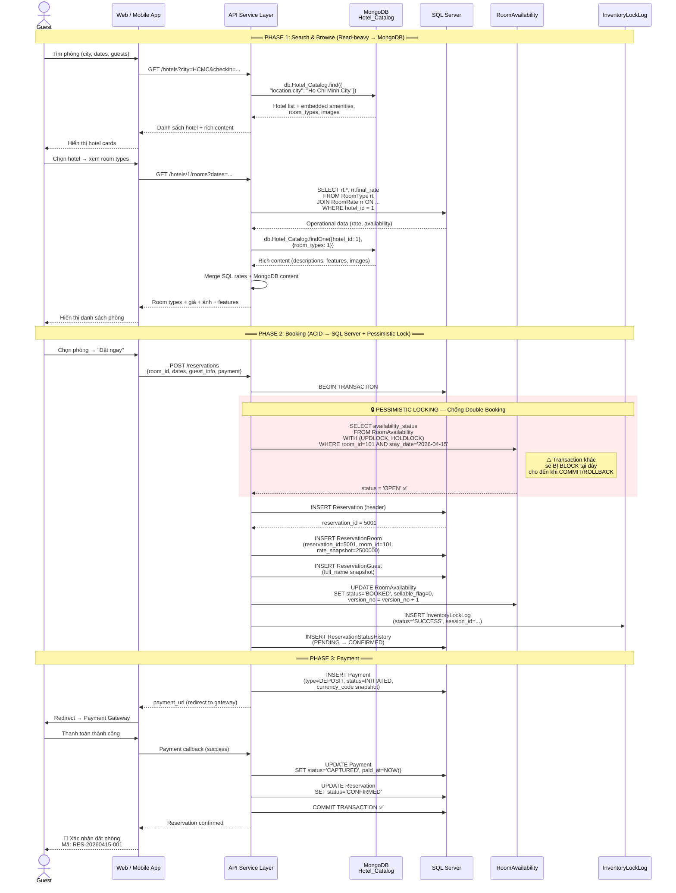
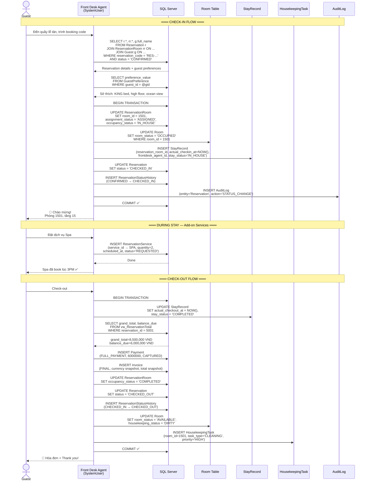
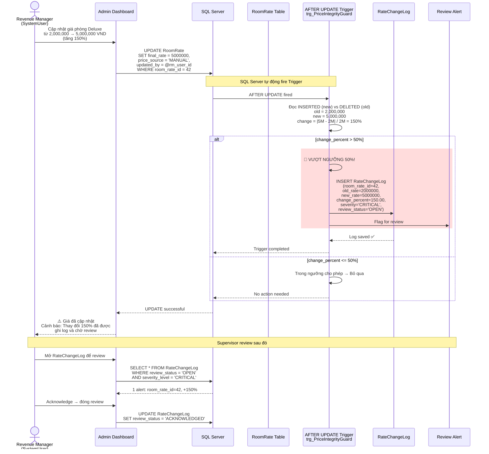
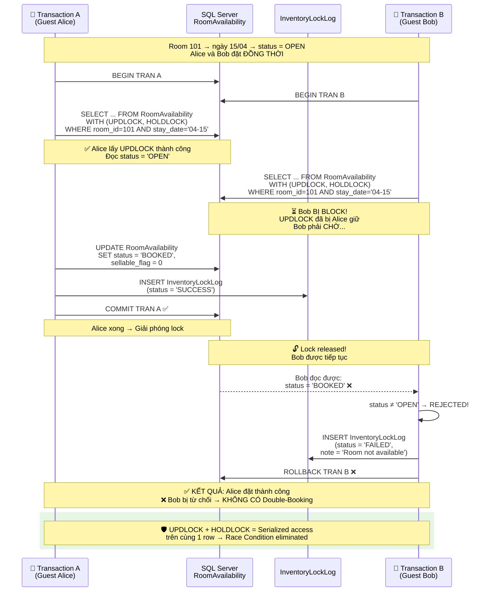

# LuxeReserve — Sequence Diagrams (Core Flows)

> **Source**: `GlobalLuxuryHotelReservationEngine_REMAKE.groovy`
> **Chỉ tập trung 4 flow cốt lõi** — bỏ qua các flow phụ (CRUD cơ bản, profile update, v.v.)

---

## Flow 1: Room Reservation — Pessimistic Locking (Core)

> **Đây là flow quan trọng nhất** — thể hiện ACID transaction, pessimistic locking chống double-booking, và tương tác Hybrid SQL + MongoDB.

---

## Flow 2: Check-in & Check-out

> Thể hiện lifecycle phòng: Reservation → StayRecord → HousekeepingTask → Available lại.

---

## Flow 3: Rate Update — Price Integrity Guard (Trigger)

> Thể hiện cách Trigger tự động bảo vệ tính toàn vẹn giá khi Revenue Manager cập nhật rate.

---

## Flow 4: Double-Booking Race Condition (Concurrency Defense)

> Thể hiện **2 transactions đồng thời** cùng đặt 1 phòng — chỉ 1 thành công nhờ Pessimistic Locking.

---

## Tổng hợp: Ma trận Flow ↔ Tables ↔ Kỹ thuật

| Flow | Tables chính | Kỹ thuật nổi bật |
|------|-------------|------------------|
| **1. Reservation** | RoomAvailability, Reservation, ReservationRoom, ReservationGuest, Payment, InventoryLockLog | Pessimistic Lock (`UPDLOCK + HOLDLOCK`), ACID Transaction, Hybrid SQL+MongoDB merge |
| **2. Check-in/out** | Reservation, ReservationRoom, StayRecord, Room, HousekeepingTask, Invoice, vw_ReservationTotal | Status lifecycle, VIEW tính toán tài chính, auto-create HK task |
| **3. Rate Guard** | RoomRate, RateChangeLog | AFTER UPDATE Trigger, `INSERTED`/`DELETED` virtual tables, TRY...CATCH |
| **4. Double-Booking** | RoomAvailability, InventoryLockLog | Pessimistic Locking, Race Condition defense, concurrent transactions |
