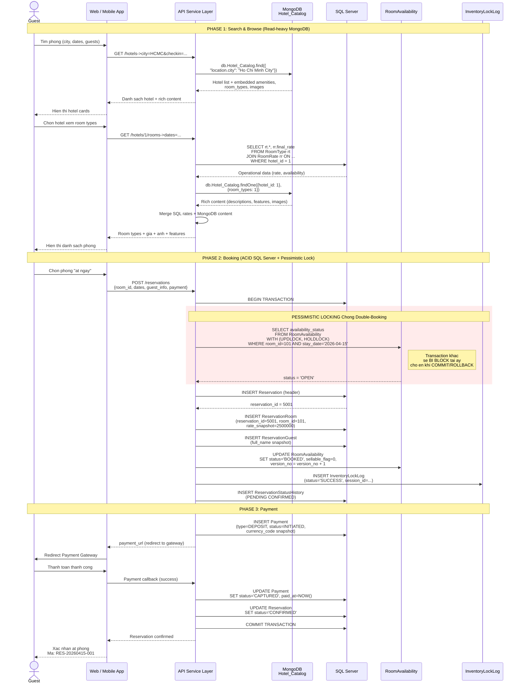
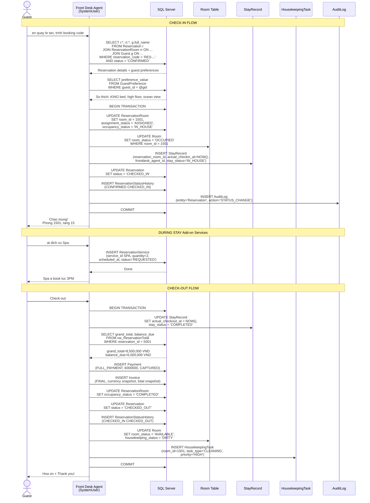
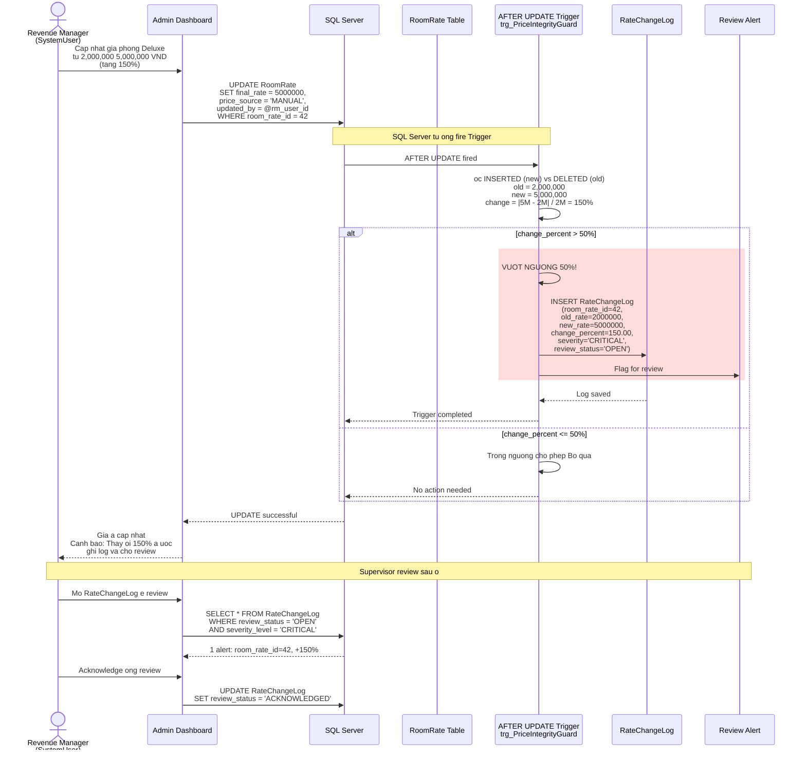
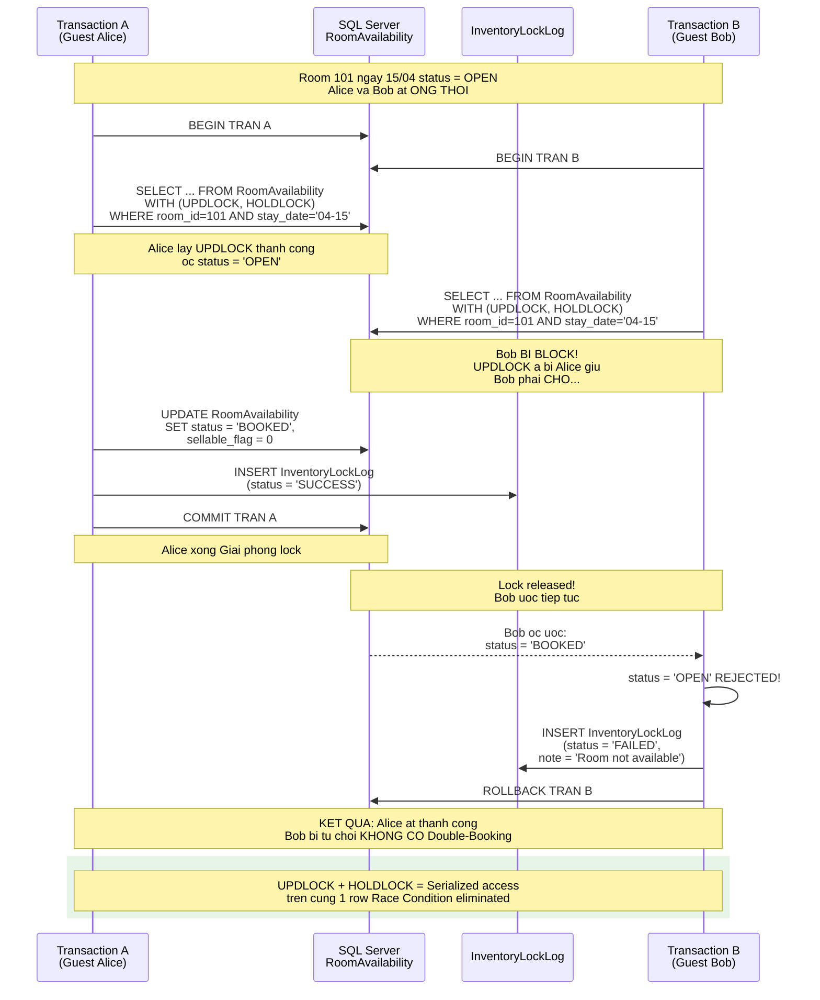

# LuxeReserve  Sequence Diagrams (Core Flows)

> **Source**: `GlobalLuxuryHotelReservationEngine_REMAKE.groovy`
> **Chi tap trung 4 flow cot loi**  bo qua cac flow phu (CRUD co ban, profile update, v.v.)

---

## Flow 1: Room Reservation  Pessimistic Locking (Core)

> **ay la flow quan trong nhat**  the hien ACID transaction, pessimistic locking chong double-booking, va tuong tac Hybrid SQL + MongoDB.

---

## Flow 2: Check-in & Check-out

> The hien lifecycle phong: Reservation  StayRecord  HousekeepingTask  Available lai.

---

## Flow 3: Rate Update  Price Integrity Guard (Trigger)

> The hien cach Trigger tu ong bao ve tinh toan ven gia khi Revenue Manager cap nhat rate.

---

## Flow 4: Double-Booking Race Condition (Concurrency Defense)

> The hien **2 transactions ong thoi** cung at 1 phong  chi 1 thanh cong nho Pessimistic Locking.

---

## Tong hop: Ma tran Flow  Tables  Ky thuat

| Flow | Tables chinh | Ky thuat noi bat |
------------------------------------------------------------
| **1. Reservation** | RoomAvailability, Reservation, ReservationRoom, ReservationGuest, Payment, InventoryLockLog | Pessimistic Lock (`UPDLOCK + HOLDLOCK`), ACID Transaction, Hybrid SQL+MongoDB merge |
| **2. Check-in/out** | Reservation, ReservationRoom, StayRecord, Room, HousekeepingTask, Invoice, vw_ReservationTotal | Status lifecycle, VIEW tinh toan tai chinh, auto-create HK task |
| **3. Rate Guard** | RoomRate, RateChangeLog | AFTER UPDATE Trigger, `INSERTED`/`DELETED` virtual tables, TRY...CATCH |
| **4. Double-Booking** | RoomAvailability, InventoryLockLog | Pessimistic Locking, Race Condition defense, concurrent transactions |
