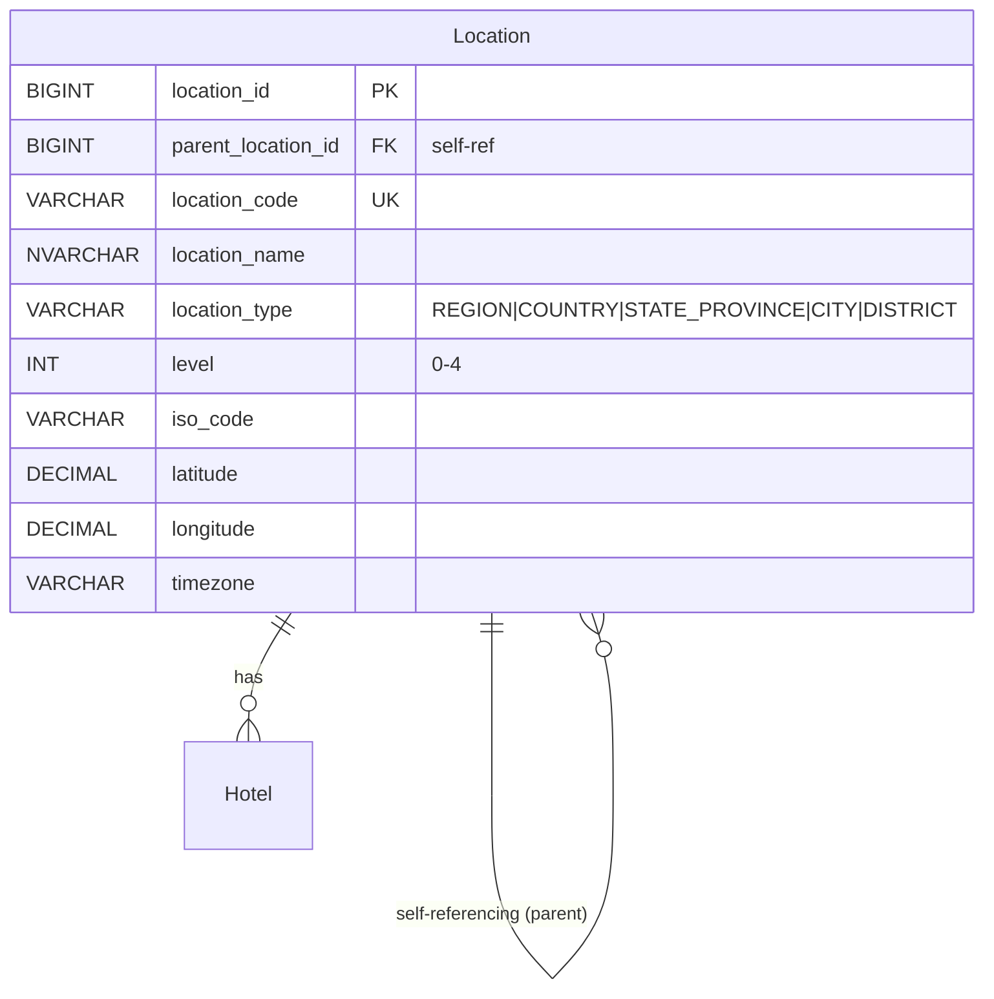
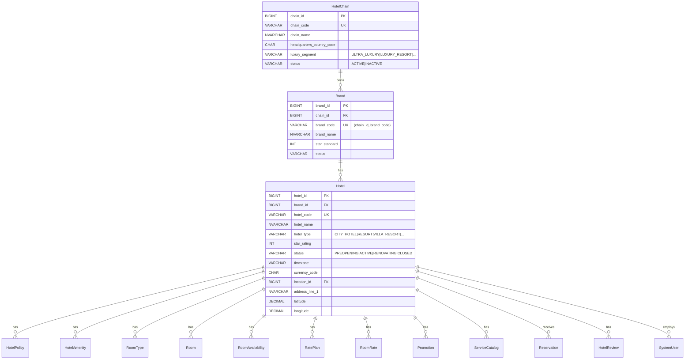
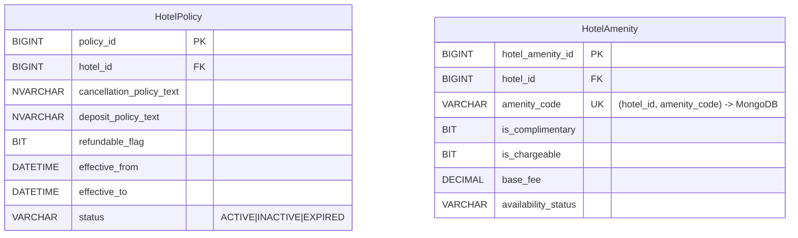
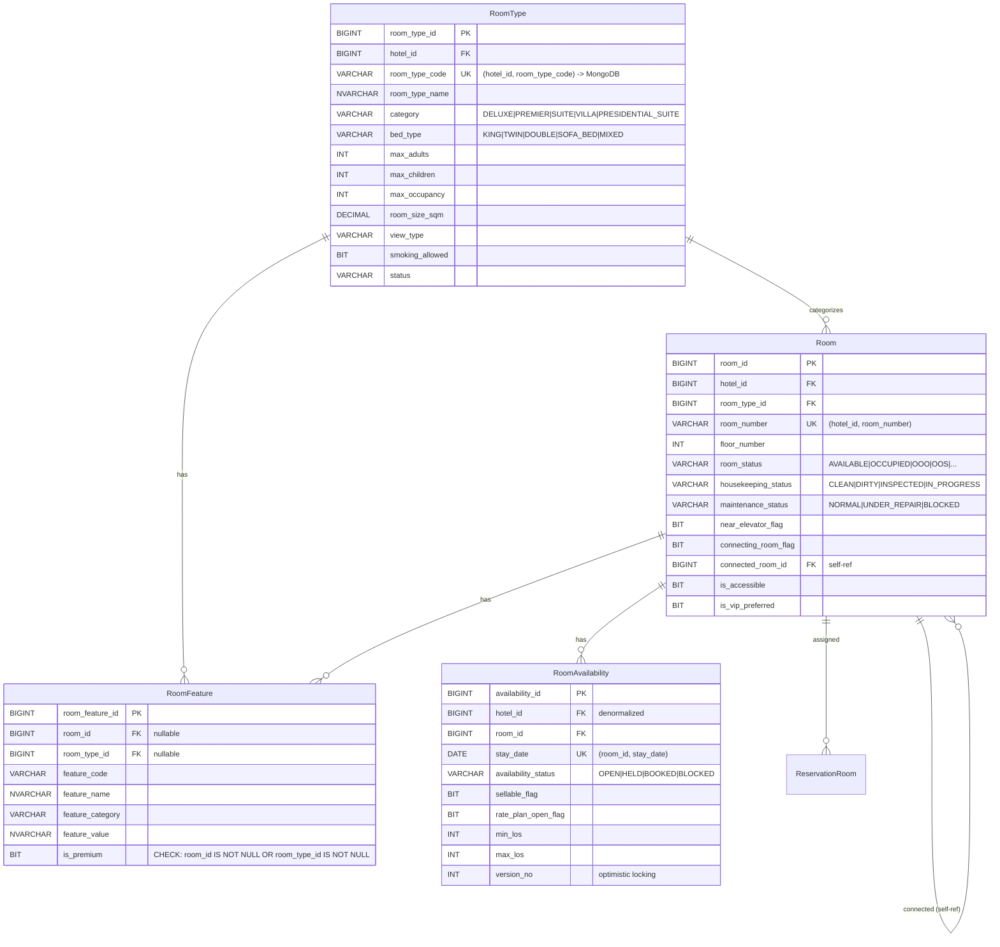
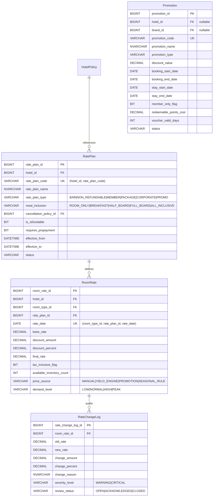
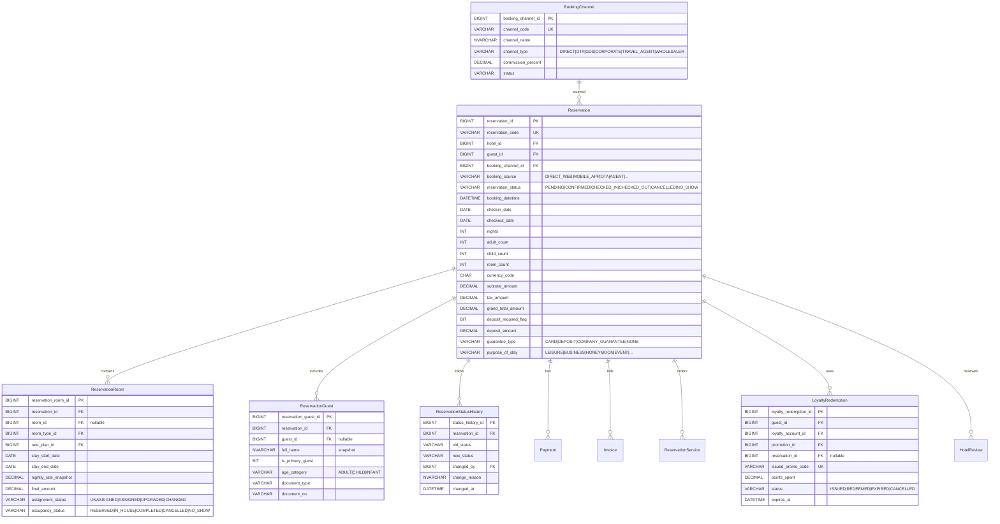
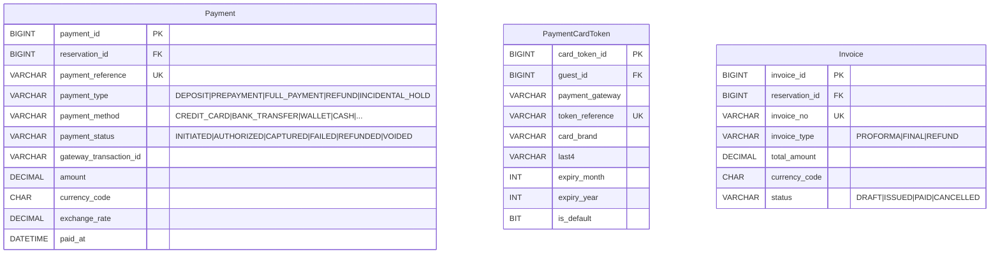
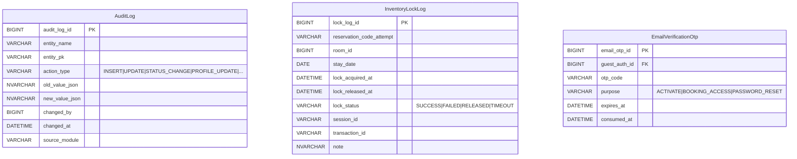
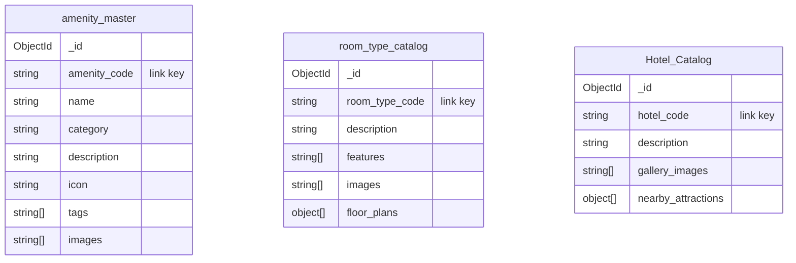

# LuxeReserve — Entity Relationship Diagram (ERD)

> **Engine:** SQL Server 2022 Express (T-SQL) + MongoDB (Hybrid)
> **Total Tables:** 30+ SQL tables + 3 MongoDB collections

---

## 1. Location Hierarchy



---

## 2. Hotel Chain → Brand → Hotel



---

## 3. Hotel Policies & Amenities



> **Note:** `amenity_master` (name, description, images, tags) is stored in **MongoDB**.
> `HotelAmenity.amenity_code` is the link key.

---

## 4. Room Management



---

## 5. Guest Management

```mermaid
erDiagram
    Guest ||--o{ GuestAddress : "has"
    Guest ||--o{ GuestPreference : "has"
    Guest ||--o{ LoyaltyAccount : "has"
    Guest ||--o{ GuestAuth : "has"
    Guest ||--o{ Reservation : "makes"
    Guest ||--o{ PaymentCardToken : "has"
    Guest ||--o{ LoyaltyRedemption : "redeems"
    Guest ||--o{ HotelReview : "writes"

    Guest {
        BIGINT guest_id PK
        VARCHAR guest_code UK
        NVARCHAR title
        NVARCHAR first_name
        NVARCHAR middle_name
        NVARCHAR last_name
        NVARCHAR full_name "COMPUTED PERSISTED: CONCAT(first_name, middle_name, last_name)"
        VARCHAR gender "MALE|FEMALE|OTHER|UNDISCLOSED"
        DATE date_of_birth
        CHAR nationality_country_code
        VARCHAR email
        VARCHAR phone_number
        BIT vip_flag
        BIT marketing_opt_in_flag
        VARCHAR identity_document_type
        VARCHAR identity_document_no
    }

    GuestAddress {
        BIGINT guest_address_id PK
        BIGINT guest_id FK
        VARCHAR address_type "HOME|WORK|BILLING"
        NVARCHAR address_line_1
        NVARCHAR city
        CHAR country_code
        BIT is_primary
    }

    GuestPreference {
        BIGINT preference_id PK
        BIGINT guest_id FK
        VARCHAR preference_type "BED|PILLOW|DIET|VIEW|..."
        NVARCHAR preference_value
        VARCHAR priority_level "LOW|MEDIUM|HIGH|CRITICAL"
    }

    LoyaltyAccount {
        BIGINT loyalty_account_id PK
        BIGINT guest_id FK
        BIGINT chain_id FK
        VARCHAR membership_no UK
        VARCHAR tier_code "SILVER|GOLD|PLATINUM|BLACK"
        DECIMAL points_balance
        DECIMAL lifetime_points
        DATE enrollment_date
        DATE expiry_date
        VARCHAR status "ACTIVE|SUSPENDED|EXPIRED|CLOSED"
    }

    GuestAuth {
        BIGINT guest_auth_id PK
        BIGINT guest_id FK UK
        VARCHAR login_email UK
        VARCHAR password_hash
        VARCHAR account_status "ACTIVE|LOCKED|DISABLED"
        DATETIME email_verified_at
        DATETIME last_login_at
    }
```

---

## 6. System Users & Roles

```mermaid
erDiagram
    SystemUser ||--o{ UserRole : "has"
    Role ||--o{ UserRole : "assigned"
    SystemUser ||--o{ UserRole : "assigned_by"

    SystemUser {
        BIGINT user_id PK
        BIGINT hotel_id FK "nullable"
        VARCHAR username UK
        VARCHAR password_hash
        NVARCHAR full_name
        VARCHAR email
        VARCHAR department "FRONT_OFFICE|RESERVATIONS|HOUSEKEEPING|..."
        VARCHAR account_status "ACTIVE|LOCKED|DISABLED"
    }

    Role {
        BIGINT role_id PK
        VARCHAR role_code UK
        NVARCHAR role_name
    }

    UserRole {
        BIGINT user_role_id PK
        BIGINT user_id FK
        BIGINT role_id FK
        DATETIME assigned_at
        BIGINT assigned_by FK "nullable"
        "UK: (user_id, role_id)"
    }
```

---

## 7. Rate & Pricing



---

## 8. Booking & Reservation



---

## 9. Payment & Invoice



---

## 10. Services & Stay

```mermaid
erDiagram
    ServiceCatalog ||--o{ ReservationService : "ordered"
    ReservationRoom ||--o{ ReservationService : "references"
    ReservationRoom ||--o{ StayRecord : "records"

    ServiceCatalog {
        BIGINT service_id PK
        BIGINT hotel_id FK
        VARCHAR service_code UK "(hotel_id, service_code)"
        NVARCHAR service_name
        VARCHAR service_category "SPA|AIRPORT_TRANSFER|DINING|BUTLER|..."
        VARCHAR pricing_model "PER_USE|PER_HOUR|PER_PERSON|PACKAGE|PER_TRIP"
        DECIMAL base_price
        BIT is_active
        BIT requires_advance_booking
    }

    ReservationService {
        BIGINT reservation_service_id PK
        BIGINT reservation_id FK
        BIGINT reservation_room_id FK "nullable"
        BIGINT service_id FK
        DATETIME scheduled_at
        INT quantity
        DECIMAL unit_price
        DECIMAL final_amount
        VARCHAR service_status "REQUESTED|CONFIRMED|DELIVERED|CANCELLED"
    }

    StayRecord {
        BIGINT stay_id PK
        BIGINT reservation_room_id FK UK
        DATETIME actual_checkin_at
        DATETIME actual_checkout_at
        BIGINT frontdesk_agent_id FK
        VARCHAR stay_status "EXPECTED|IN_HOUSE|COMPLETED|NO_SHOW"
        DECIMAL deposit_hold_amount
    }

    HotelReview {
        BIGINT hotel_review_id PK
        BIGINT hotel_id FK
        BIGINT guest_id FK
        BIGINT reservation_id FK UK
        INT rating_score "1-5"
        NVARCHAR review_title
        NVARCHAR review_text
        BIT public_visible_flag
        VARCHAR moderation_status "PUBLISHED|HIDDEN"
    }
```

---

## 11. Audit & Logging



---

## 12. MongoDB Collections (Hybrid Schema)



---

## Legend

| Symbol | Meaning |
|--------|---------|
| `PK` | Primary Key |
| `FK` | Foreign Key |
| `UK` | Unique Key |
| `||--o{` | One-to-Many relationship |
| `||--||` | One-to-One relationship |
| `"..."` | CHECK constraint values |
| `-> MongoDB` | Cross-reference to MongoDB collection |

---

*Generated from `database/sql/` scripts (01–24) and `database/mongodb/` scripts.*
