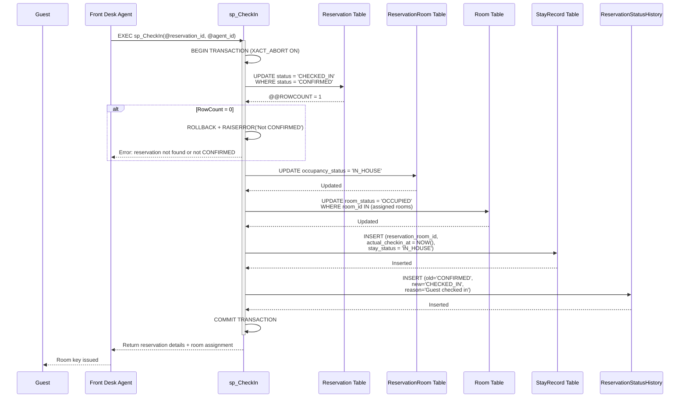
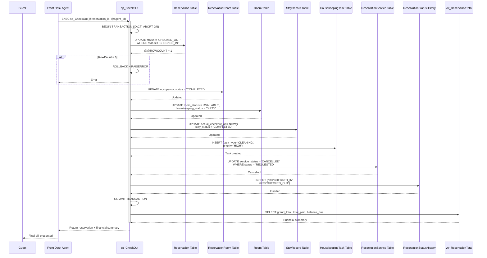
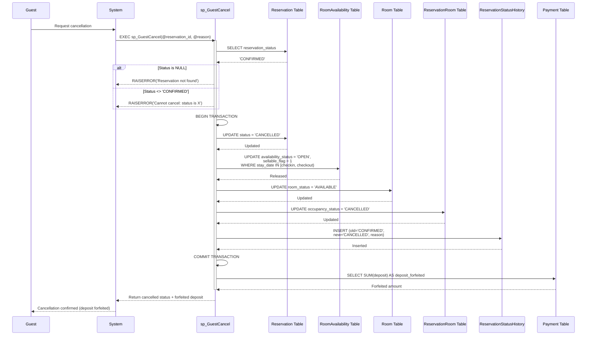
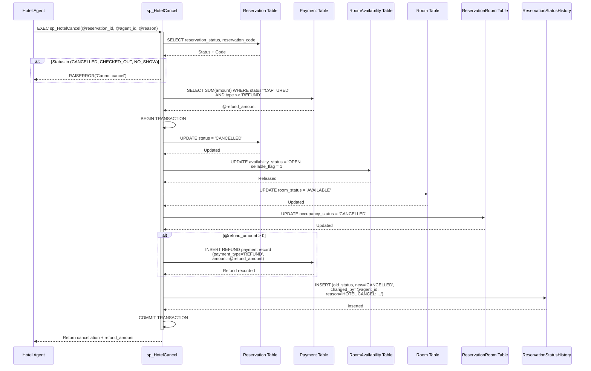
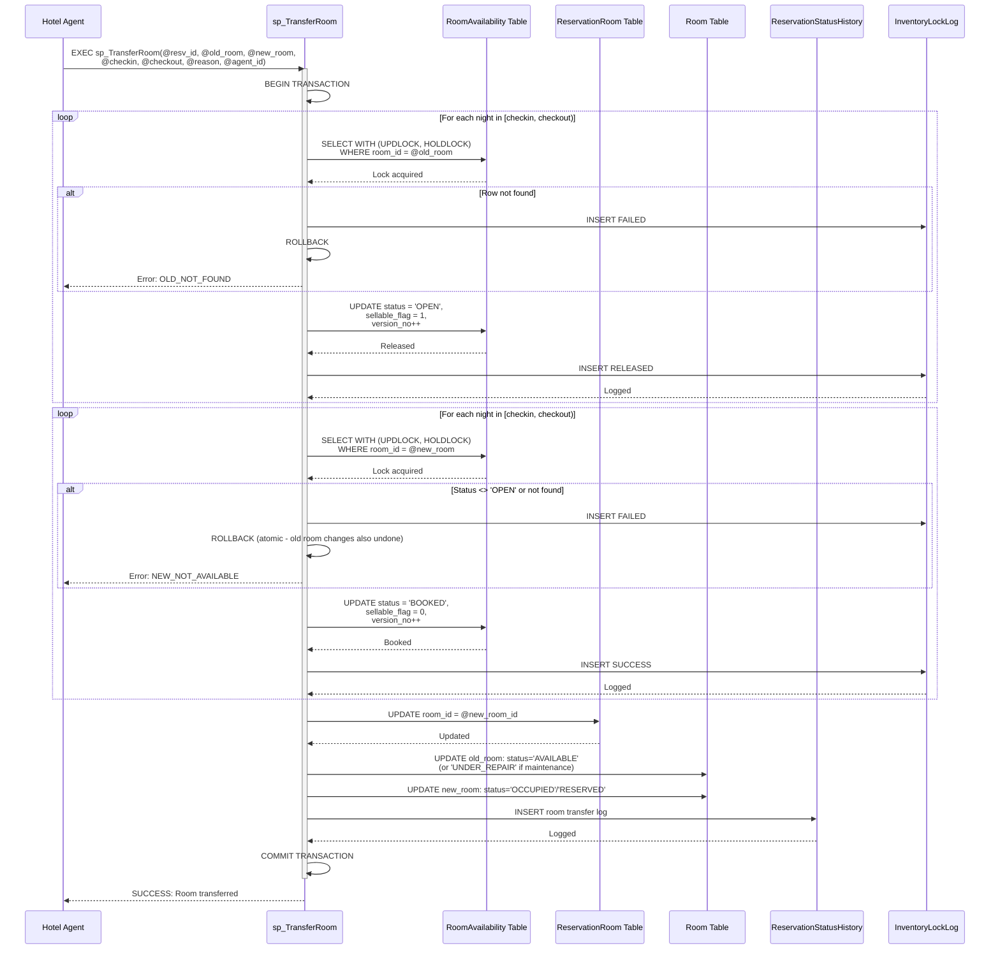
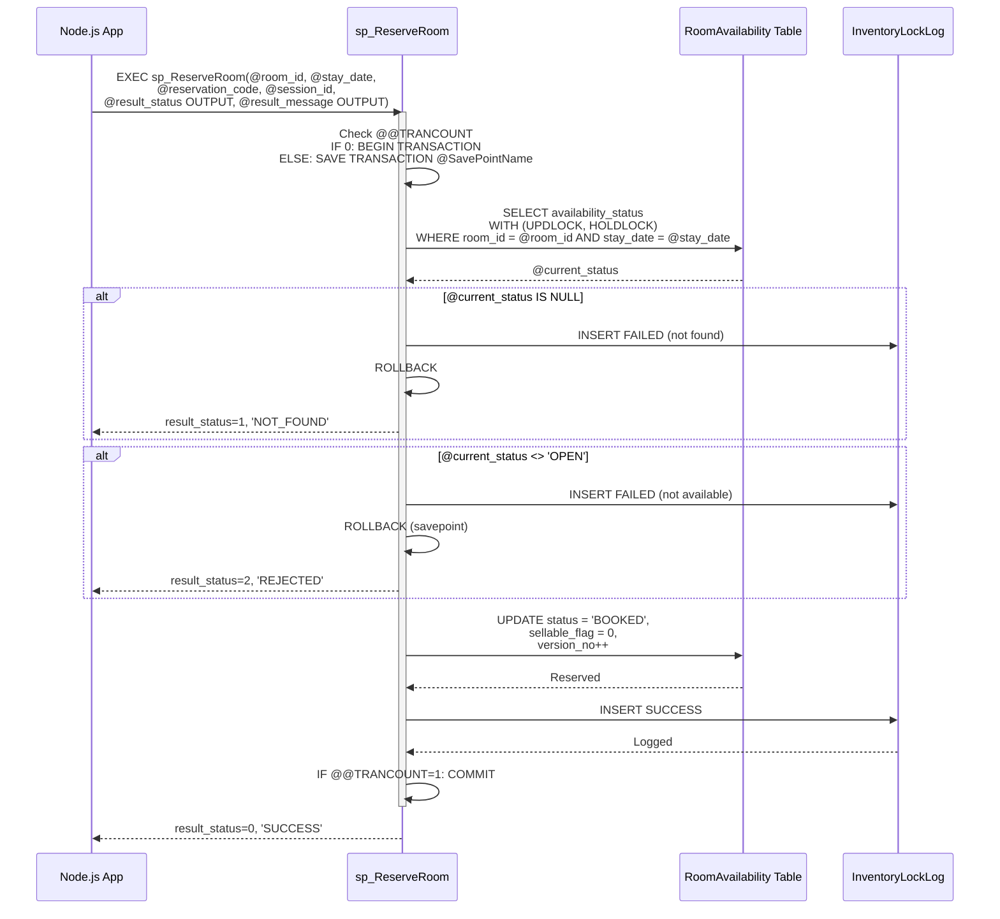
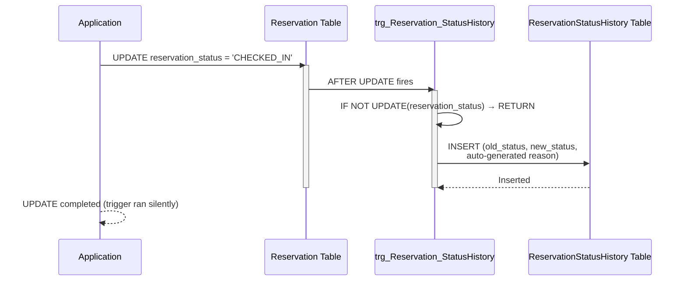
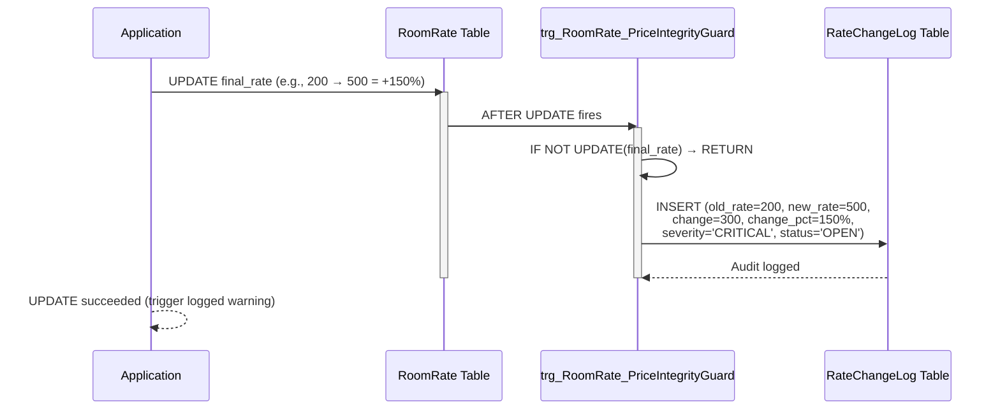
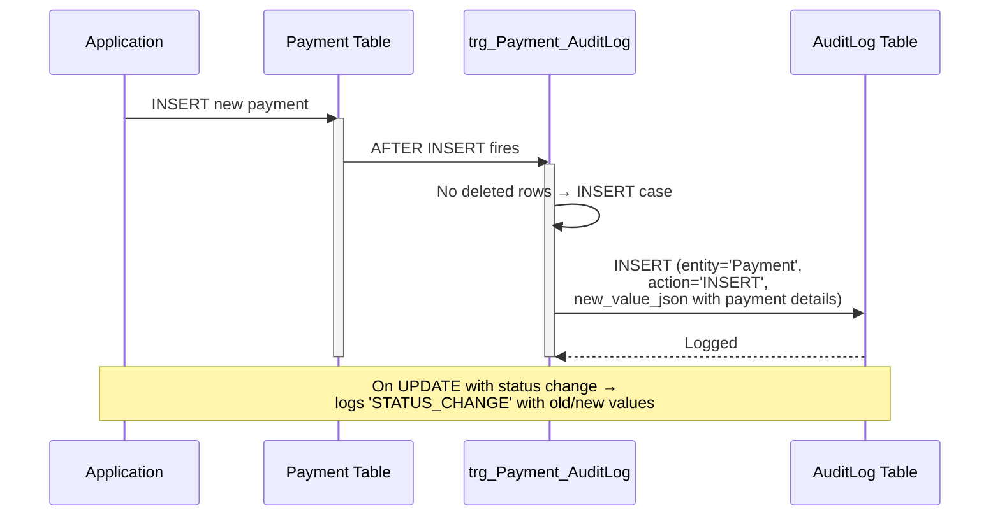

# LuxeReserve — Sequence Diagrams

> **Engine:** SQL Server 2022 Express (T-SQL)
> **Key Business Flows:** Check-in, Check-out, Cancellation, Room Transfer, Reservation, Cleanup

---

## 1. Check-In Flow (`sp_CheckIn`)



---

## 2. Check-Out Flow (`sp_CheckOut`)



---

## 3. Guest Cancellation (`sp_GuestCancel`)



---

## 4. Hotel Cancellation with Refund (`sp_HotelCancel`)



---

## 5. Room Transfer with Pessimistic Locking (`sp_TransferRoom`)



---

## 6. Room Reservation with Pessimistic Locking (`sp_ReserveRoom`)



---

## 7. Abandoned Reservation Cleanup (`sp_CleanupAbandonedReservations`)

```mermaid
sequenceDiagram
    participant Scheduler as Scheduled Job
    participant sp_Cleanup as sp_CleanupAbandonedReservations
    participant sp_Cancel as sp_CancelAbandonedReservation
    participant Reservation as Reservation Table
    participant Payment as Payment Table
    participant #Abandoned as Temp Table #Abandoned
    participant Cursor as Cursor

    Scheduler->>sp_Cleanup: EXEC sp_CleanupAbandonedReservations(@window_minutes = 30)
    activate sp_Cleanup

    %% Collect abandoned reservations
    sp_Cleanup->>Reservation: SELECT WHERE status='CONFIRMED'<br/>AND created_at < NOW - 30min<br/>AND no captured payment
    Reservation-->>sp_Cleanup: Abandoned reservations
    sp_Cleanup->>#Abandoned: INSERT INTO temp table

    %% Cursor loop
    sp_Cleanup->>Cursor: DECLARE CURSOR FOR SELECT reservation_code
    activate Cursor

    loop For each abandoned reservation
        Cursor-->>sp_Cleanup: Next @code
        sp_Cleanup->>sp_Cancel: EXEC sp_CancelAbandonedReservation(@code, @reason)
        activate sp_Cancel

        sp_Cancel->>Reservation: UPDATE status = 'CANCELLED'
        sp_Cancel->>RoomAvail: UPDATE status = 'OPEN', sellable_flag = 1
        sp_Cancel->>ResvRoom: UPDATE occupancy_status = 'CANCELLED'
        sp_Cancel->>StatusHist: INSERT status change log

        deactivate sp_Cancel
    end

    deactivate Cursor

    sp_Cleanup-->>Scheduler: Return list of cancelled reservation_ids + codes

    deactivate sp_Cleanup
```

---

## 8. Trigger: Auto-Status-History (`trg_Reservation_StatusHistory`)



---

## 9. Trigger: Price Integrity Guard (`trg_RoomRate_PriceIntegrityGuard`)



---

## 10. Trigger: Payment Audit Log (`trg_Payment_AuditLog`)



---

## Legend

| Symbol | Meaning |
|--------|---------|
| `->>` | Synchronous call |
| `-->>` | Return/response |
| `activate` | Start lifeline |
| `deactivate` | End lifeline |
| `alt` | Conditional branch |
| `loop` | Iteration |
| `Note over` | Annotation |

---

*Generated from `database/sql/05_create_procedures.sql`, `database/sql/23_advanced_stored_procedures.sql`, `database/sql/24_audit_triggers.sql`, and `database/sql/04_create_triggers.sql`.*
